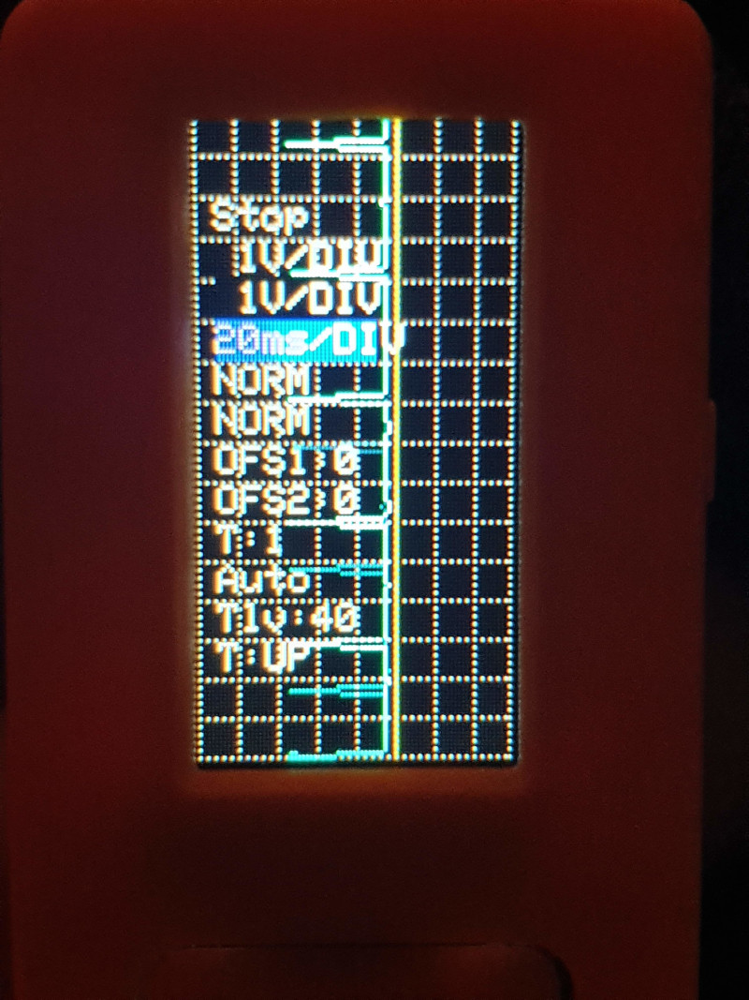

# M5StickC ESP32 Oscilloscope

A fully functional oscilloscope based on ESp32 M5StickC 
ported from https://github.com/botofancalin/M5Stack-ESP32-Oscilloscope

## Changes from original
- Channel 1 Input: Pin 25
- Channel 2 input: Pin 36
- PWM signal Output: Pin 33
- SignaDelta Output: Pin 32
- Key B: Menu selection
- Key A: Next Selected item (loop)

